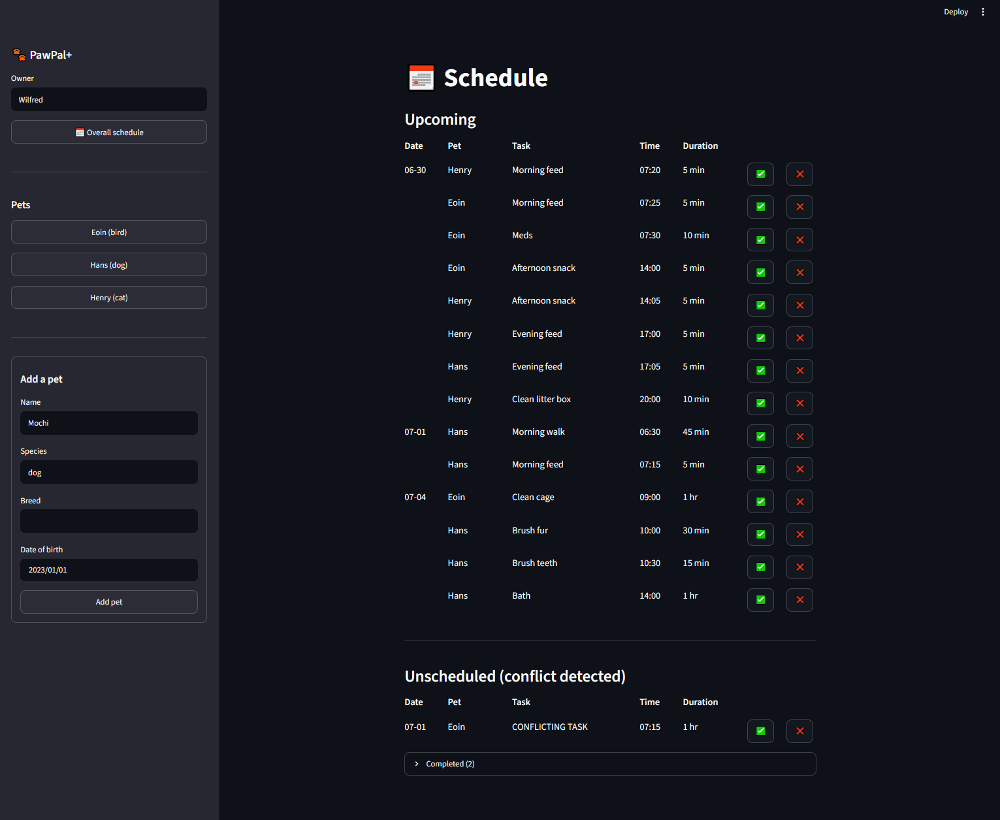
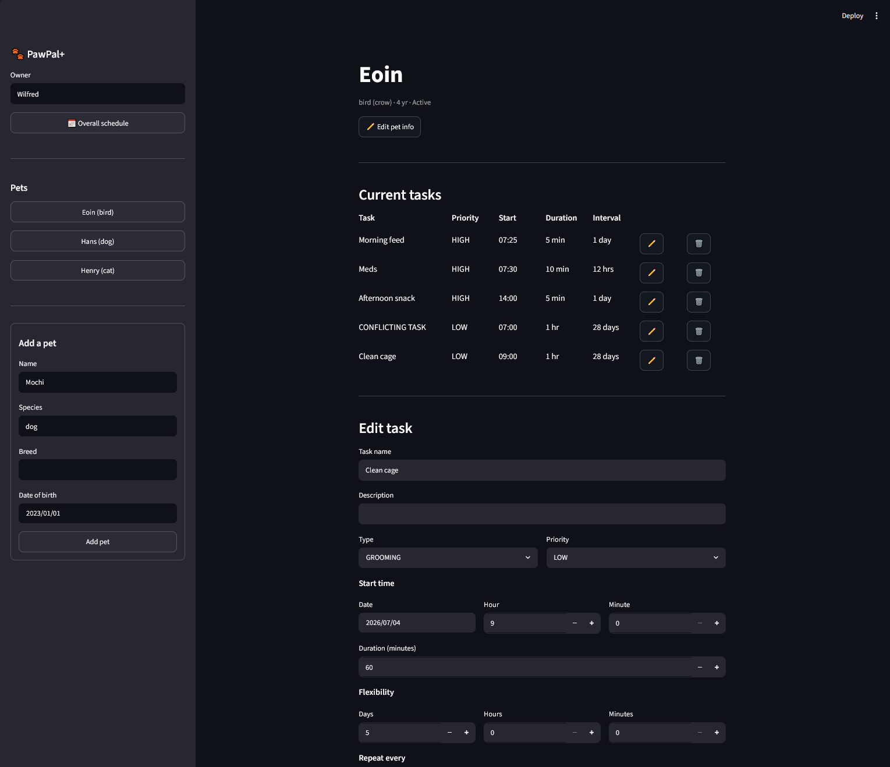

# PawPal+ (Module 2 Project)

You are building **PawPal+**, a Streamlit app that helps a pet owner plan care tasks for their pet.

## Scenario

A busy pet owner needs help staying consistent with pet care. They want an assistant that can:

- Track pet care tasks (walks, feeding, meds, enrichment, grooming, etc.)
- Consider constraints (time available, priority, owner preferences)
- Produce a daily plan and explain why it chose that plan

Your job is to design the system first (UML), then implement the logic in Python, then connect it to the Streamlit UI.

## What you will build

Your final app should:

- Let a user enter basic owner + pet info
- Let a user add/edit tasks (duration + priority at minimum)
- Generate a daily schedule/plan based on constraints and priorities
- Display the plan clearly (and ideally explain the reasoning)
- Include tests for the most important scheduling behaviors

## Getting started

### Setup

```bash
python -m venv .venv
source .venv/bin/activate  # Windows: .venv\Scripts\activate
pip install -r requirements.txt
```

### Suggested workflow

1. Read the scenario carefully and identify requirements and edge cases.
2. Draft a UML diagram (classes, attributes, methods, relationships).
3. Convert UML into Python class stubs (no logic yet).
4. Implement scheduling logic in small increments.
5. Add tests to verify key behaviors.
6. Connect your logic to the Streamlit UI in `app.py`.
7. Refine UML so it matches what you actually built.

## 🖥️ Sample Output

Paste a sample of your app's CLI or Streamlit output here so a reader can see what a generated plan looks like:

```
2026-06-29
    06:30:00 - 07:15:00 | Hans - Morning walk
    07:15:00 - 07:20:00 | Hans - Morning feed
    07:20:00 - 07:25:00 | Henry - Morning feed
    07:25:00 - 07:30:00 | Eoin - Morning feed
    07:30:00 - 07:40:00 | Eoin - Meds
    14:00:00 - 14:05:00 | Eoin - Afternoon snack
    14:05:00 - 14:10:00 | Henry - Afternoon snack
    17:00:00 - 17:05:00 | Henry - Evening feed
    17:05:00 - 17:10:00 | Hans - Evening feed
    20:00:00 - 20:10:00 | Henry - Clean litter box

2026-07-04
    09:00:00 - 10:00:00 | Eoin - Clean cage
    10:00:00 - 10:30:00 | Hans - Brush fur
    10:30:00 - 10:45:00 | Hans - Brush teeth
    14:00:00 - 15:00:00 | Hans - Bath
```

## 🧪 Testing PawPal+

```bash
# Run the full test suite:
pytest

# Run with coverage:
pytest --cov
```

Sample test output:

```
collected 40 items

tests/test_pawpal.py::test_add_task PASSED                                                        [  2%]
tests/test_pawpal.py::test_mark_complete PASSED                                                   [  5%]
tests/test_pawpal.py::test_find_gap_empty_schedule PASSED                                         [  7%]
tests/test_pawpal.py::test_find_gap_before_first PASSED                                           [ 10%]
tests/test_pawpal.py::test_find_gap_touching_before_first PASSED                                  [ 12%]
tests/test_pawpal.py::test_find_gap_after_last PASSED                                             [ 15%]
tests/test_pawpal.py::test_find_gap_touching_after_last PASSED                                    [ 17%]
tests/test_pawpal.py::test_find_gap_overlaps_only_instance PASSED                                 [ 20%]
tests/test_pawpal.py::test_find_gap_identical_span_overlaps PASSED                                [ 22%]
tests/test_pawpal.py::test_find_gap_middle_gap PASSED                                             [ 25%]
tests/test_pawpal.py::test_find_gap_middle_gap_exact_fit PASSED                                   [ 27%]
tests/test_pawpal.py::test_find_gap_middle_gap_one_minute_too_big PASSED                          [ 30%]
tests/test_pawpal.py::test_find_gap_overlaps_first_of_many PASSED                                 [ 32%]
tests/test_pawpal.py::test_find_gap_overlaps_last_of_many PASSED                                  [ 35%]
tests/test_pawpal.py::test_find_gap_envelops_existing_instance PASSED                             [ 37%]
tests/test_pawpal.py::test_find_gap_zero_duration_in_gap PASSED                                   [ 40%]
tests/test_pawpal.py::test_fit_delay_into_following_gap PASSED                                    [ 42%]
tests/test_pawpal.py::test_fit_delay_skips_too_small_gap PASSED                                   [ 45%]
tests/test_pawpal.py::test_fit_delay_flexibility_boundary_inclusive PASSED                        [ 47%]
tests/test_pawpal.py::test_fit_delay_gap_exactly_duration PASSED                                  [ 50%]
tests/test_pawpal.py::test_fit_delay_exceeds_flexibility_returns_none PASSED                      [ 52%]
tests/test_pawpal.py::test_fit_delay_appends_after_last_instance PASSED                           [ 55%]
tests/test_pawpal.py::test_fit_delay_no_instance_after_start_returns_none PASSED                  [ 57%]
tests/test_pawpal.py::test_fit_delay_start_before_all_ends PASSED                                 [ 60%]
tests/test_pawpal.py::test_extract_conflicts_empty_schedule PASSED                                [ 62%]
tests/test_pawpal.py::test_extract_conflicts_no_overlap_kept PASSED                               [ 65%]
tests/test_pawpal.py::test_extract_conflicts_single_lower_priority_removed PASSED                 [ 67%]
tests/test_pawpal.py::test_extract_conflicts_equal_priority_kept PASSED                           [ 70%]
tests/test_pawpal.py::test_extract_conflicts_higher_priority_kept PASSED                          [ 72%]
tests/test_pawpal.py::test_extract_conflicts_touching_boundary_kept PASSED                        [ 75%]
tests/test_pawpal.py::test_extract_conflicts_multiple_removed_in_reverse_order PASSED             [ 77%]
tests/test_pawpal.py::test_extract_conflicts_mixed_survivors_keep_order PASSED                    [ 80%]
tests/test_pawpal.py::test_extract_conflicts_zero_duration_ti_inside_interval PASSED              [ 82%]
tests/test_pawpal.py::test_mark_complete_daily_task_creates_next_day_instance PASSED              [ 85%]
tests/test_pawpal.py::test_mark_complete_sets_status_on_original PASSED                           [ 87%]
tests/test_pawpal.py::test_mark_complete_successor_copies_identifiers_and_is_pending PASSED       [ 90%]
tests/test_pawpal.py::test_mark_complete_non_done_status_still_creates_successor PASSED           [ 92%]
tests/test_pawpal.py::test_mark_complete_weekly_interval PASSED                                   [ 95%]
tests/test_pawpal.py::test_mark_complete_sub_day_interval_same_day PASSED                         [ 97%]
tests/test_pawpal.py::test_mark_complete_successor_timing_independent_of_actual_completion PASSED [100%]

========================================== 40 passed in 0.08s ==========================================
```

## 📐 Features

| Feature | Method(s) | Notes |
|---------|-----------|-------|
| Filtering | `Scheduler.filterPending()`, `Scheduler.removePending(match_fn)` | `filterPending()` splits the schedule into pending vs. completed by `TaskStatus`; `removePending()` removes only pending instances matching a predicate and reports whether any completed ones remain (so history is preserved). |
| Ordered placement (sorting) | `Scheduler.insert(ti)`, `Scheduler.find_gap(ti)` | The schedule is kept sorted by start time via ordered insertion rather than re-sorting: `find_gap()` returns the index of the first free, non-overlapping slot (boundaries inclusive — touching tasks don't conflict). |
| Conflict handling | `Scheduler.insert(ti)`, `Scheduler.extract_conflicts(ti)`, `Scheduler.fit_with_delay(ti)` | When no free slot exists, `extract_conflicts()` evicts lower-priority overlapping instances; the new task and evictees are re-inserted in priority order. A task that still can't fit is delayed by `fit_with_delay()` (shifted later as long as the delay stays within its `flexibility`), and otherwise parked in `unscheduled`. |
| Recurring tasks | `Scheduler.mark_complete(ti, status)` | Marking an instance sets its status and spawns the next occurrence at `ti.start + task.interval` (end = start + `duration`), then inserts it — supporting daily, weekly, and sub-day cadences. |
| Priority & flexibility model | `Task.priority`, `Task.flexibility`, `DEFAULT_PF` | Each task type has default priority/flexibility (`DEFAULT_PF`); these drive eviction order and how far a task may be delayed during conflict resolution. |

## 📸 Demo Walkthrough

Describe your app in numbered steps so a reader can follow along without watching a video:

1. Create multiple pets in the sidebar
2. For each pet, select the pet in the sidebar and create multiple tasks for each pet
    - on this page you can edit the pet and also edit existing tasks
    - after creation, tasks are automatically added to the schedule
3. Click Overall schedule in the sidebar to view upcoming tasks for all pets
4. Mark task as complete or missed
5. See any conflicting events in the Unscheduled section, and past events in the Completed section

**Screenshot or video** *(optional)*: <!-- Insert a screenshot or link to a demo video here -->
  
  